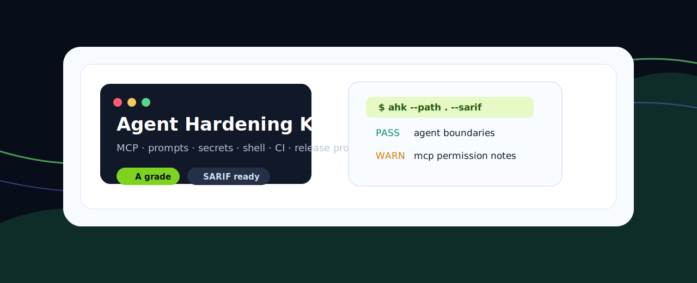
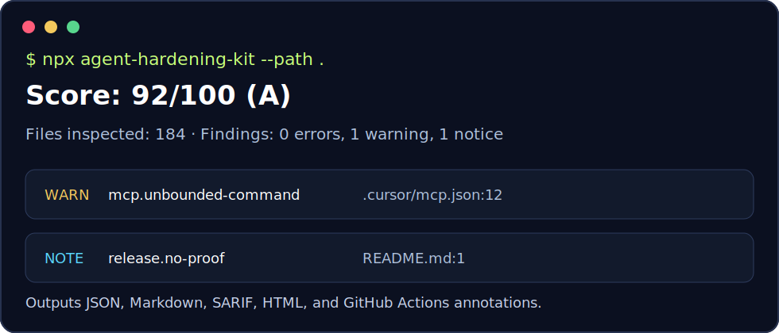

# Agent Hardening Kit



一个命令检查你的仓库是否适合交给 AI 编程 Agent、MCP 工具、Prompt 工作流和 CI 发布流程使用。

[English](README.md) · [检查项](docs/checks.md) · [GitHub Actions](docs/github-actions.md) · [威胁模型](docs/threat-model.md)

```bash
npx agent-hardening-kit --path . --markdown
```



## 它解决什么问题

现在 AI Agent 会读 Issue、改代码、调用 MCP 工具、执行 shell 命令、甚至辅助发布。仓库本身就需要一套“上线前体检”：Prompt 要标明不可信输入边界，MCP 配置要写清权限，示例不能泄露密钥，危险命令要有保护，CI 要能留下验证证据。

Agent Hardening Kit 把这些检查变成一个可本地运行、也可接入 GitHub Actions 的 CLI。

## 检查范围

| 模块 | 能发现的问题 |
| --- | --- |
| AGENTS.md | 缺少 Agent 边界、密钥规则、验证命令 |
| MCP | 本地命令启动器、疑似内联密钥、缺少权限说明 |
| Prompts | 指令覆盖语句、缺少不可信输入边界 |
| Secrets | 疑似 Token、被提交的 `.env` |
| Shell | 危险删除命令、远程脚本直连 shell 的安装方式 |
| Unicode | 不可见字符、双向控制字符 |
| CI | 缺少验证工作流、缺少测试或扫描命令 |
| Release | 缺少 changelog、tag、镜像和发布证据 |

## 快速开始

```bash
npx agent-hardening-kit --path .
npx agent-hardening-kit --path . --json
npx agent-hardening-kit --path . --sarif > agent-hardening.sarif
npx agent-hardening-kit --path . --html > agent-hardening-report.html
npx agent-hardening-kit --path . --write-policy
```

如果仓库里有故意做坏的测试样例或生成报告，可以用 `.agent-hardening-ignore` 排除。

## 为什么这个项目值得 Star

- 面向 AI Agent 和 MCP 的真实新增风险，不是普通代码格式检查。
- 对开源维护者、独立开发者、学生项目、企业内源仓库都能直接用。
- 输出 SARIF，可进入 GitHub Code Scanning。
- 零依赖，下载快，容易审计，方便贡献规则。
- 英中双语文档，适合国内外传播。

## 贡献方向

- 补充更多真实 MCP 配置样例。
- 增加 GitLab CI、Gitee、Jenkins 示例。
- 增加规则抑制和白名单机制。
- 增加不同 Agent 工具的专属规则包。

先看 [CONTRIBUTING.md](CONTRIBUTING.md)，然后添加 fixture 和测试。

## 协议

MIT
